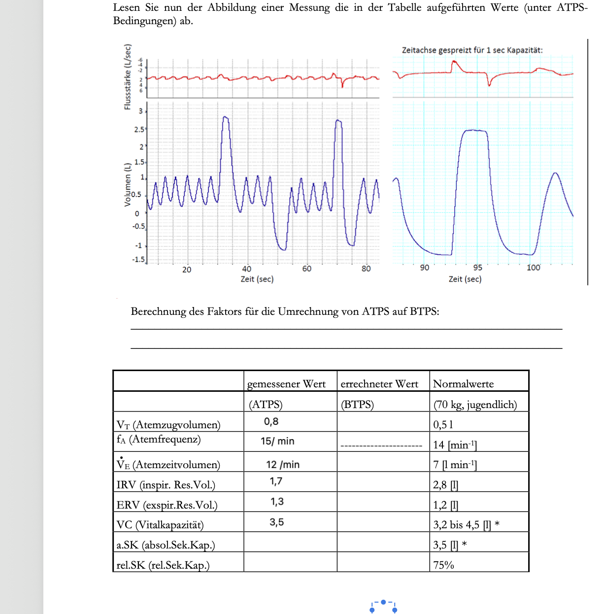

# OCT Labeling Tool

**English** | [Deutsch](#deutsch) | [한국어](#한국어)

---

## English

### Background

During a medical imaging lecture on early lung cancer detection, I learned that peripheral lung lesions found via low-dose CT screening are very difficult to biopsy using conventional bronchoscopy.

Optical biopsy based on OCT is emerging as a radiation-free future diagnostic approach. However, lung OCT images may still suffer from limited penetration depth, speckle noise, motion artifacts, and interpretation challenges. This project focuses on a first practical step toward AI-assisted analysis: building a structured annotation workflow for imperfect medical imaging data.

While general annotation tools like CVAT and Label Studio exist, I wanted to explore a lightweight desktop workflow specifically tailored to lung OCT lesion annotation.

I built this tool as an experimental MVP to explore an AI dataset annotation workflow for lung OCT images. It currently supports JSON export, YOLO-format export, project save/load, and coordinate validation. Future plans include COCO export, mask annotation, DICOM support, zoom/pan, and brightness/contrast controls.

### What I Built

A lightweight desktop tool for annotating lung OCT images, designed to generate labeled datasets for future AI training.



### Features

- Load multiple images (jpg, jpeg, png, bmp)
- Draw bounding boxes with mouse drag
- Label regions: Normal / Suspicious / Confirmed Cancer
- Keyboard shortcuts: ←/→ to navigate, 1/2/3 to select label
- Labels persist when switching between images
- Right-click or two-finger tap to delete a box
- Multilingual UI: Korean / English / German
- Export to JSON with normalized coordinates
- Export to YOLO format for object detection training
- Save summary statistics to `summary.json`
- Project save/load using `project.json`
- Coordinate clamping for safer dataset export
- Automatic discard of bounding boxes smaller than 5×5 pixels

### Tech Stack

- Java 21
- JavaFX 21
- Maven
- Gson

### How to Run

#### Requirements

- Java 21
- JavaFX 21 SDK
- Maven

#### Run with Maven

```bash
mvn javafx:run
```

#### Manual Compile

```bash
javac --module-path /path/to/javafx/lib --add-modules javafx.controls src/*.java
```

#### Manual Run

```bash
java --module-path /path/to/javafx/lib --add-modules javafx.controls -cp src MainApp
```

#### macOS Manual Example

```bash
javac --module-path ~/javafx-sdk/javafx-sdk-21.0.2/lib --add-modules javafx.controls src/*.java
java --module-path ~/javafx-sdk/javafx-sdk-21.0.2/lib --add-modules javafx.controls -cp src MainApp
```

### Workflow

1. Load OCT images
2. Draw bounding boxes with mouse drag
3. Assign labels: Normal / Suspicious / Confirmed Cancer
4. Save the project as `project.json` for future sessions
5. Reopen the project to continue or correct annotations
6. Export annotations as JSON or YOLO format for AI training

### Export Format Examples

#### JSON Export

```json
[
  {
    "file": "image.jpeg",
    "label": "Suspicious",
    "x": 0.2425,
    "y": 0.1897,
    "w": 0.18,
    "h": 0.12,
    "x_pixel": 72,
    "y_pixel": 31,
    "image_width": 300,
    "image_height": 168
  }
]
```

#### YOLO Export

```txt
1 0.332500 0.249700 0.180000 0.120000
```

YOLO format:

```txt
class_id x_center y_center width height
```

Class mapping:

```txt
0 = Normal
1 = Suspicious
2 = Confirmed Cancer
```

### Limitations

- This tool is an experimental MVP and is not intended for clinical diagnosis.
- It currently supports bounding-box annotation only.
- DICOM support and mask-based annotation are planned for future versions.
- Coordinate accuracy may depend on image display scaling and should be validated before research use.

### Validation

- Project files are saved and loaded using Gson.
- YOLO export uses normalized center coordinates: `x_center`, `y_center`, `width`, `height`.
- Coordinates are clamped to the 0–1 range before export.
- Bounding boxes smaller than 5×5 pixels are automatically discarded.

---

## Deutsch

### Hintergrund

Während einer Vorlesung über Früherkennung von Lungenkrebs erfuhr ich, dass periphere Lungenläsionen, die im Low-dose-CT-Screening entdeckt werden, mit konventioneller Bronchoskopie sehr schwer zu biopsieren sind.

Optische Biopsie auf OCT-Basis gilt als strahlungsfreier diagnostischer Ansatz der Zukunft. Allerdings können Lungen-OCT-Bilder durch begrenzte Eindringtiefe, Speckle-Rauschen, Bewegungsartefakte und schwierige Interpretierbarkeit beeinträchtigt sein. Dieses Projekt konzentriert sich deshalb auf einen ersten praktischen Schritt in Richtung AI-gestützter Analyse: einen strukturierten Annotation-Workflow für unvollkommene medizinische Bilddaten. Obwohl allgemeine Annotationstools wie CVAT und Label Studio existieren, wollte ich einen leichtgewichtigen Desktop-Workflow speziell für die Annotation von Lungen-OCT-Läsionen experimentell umsetzen.

Dieses Tool wurde als experimentelles MVP entwickelt, um einen Workflow zur Erstellung von AI-Trainingsdatensätzen für Lungen-OCT-Bilder zu untersuchen. Es unterstützt aktuell JSON-Export, YOLO-Format-Export, Projekt-Speichern/Laden und Koordinatenvalidierung. Geplante Erweiterungen sind COCO-Export, Mask-Annotation, DICOM-Unterstützung, Zoom/Pan sowie Helligkeits- und Kontraststeuerung.

### Was ich gebaut habe

Ein leichtgewichtiges Desktop-Tool zur Annotation von Lungen-OCT-Bildern, entwickelt zur Erstellung gelabelter Datensätze für zukünftiges AI-Training.


### Funktionen

- Mehrere Bilder laden (jpg, jpeg, png, bmp)
- Bounding Boxes per Maus-Drag zeichnen
- Regionen beschriften: Normal / Verdächtig / Bestätigter Krebs
- Tastaturkürzel: ←/→ navigieren, 1/2/3 Label wählen
- Labels bleiben beim Wechsel zwischen Bildern erhalten
- Rechtsklick oder Zwei-Finger-Tap zum Löschen einer Box
- Mehrsprachige Oberfläche: Koreanisch / Englisch / Deutsch
- JSON-Export mit normalisierten Koordinaten
- YOLO-Format-Export für Object-Detection-Training
- Summary-Statistiken werden in `summary.json` gespeichert
- Projekt speichern/laden mit `project.json`
- Koordinaten-Clamping für sicheren Datensatz-Export
- Automatisches Verwerfen von Bounding Boxes kleiner als 5×5 Pixel

### Technologie

- Java 21
- JavaFX 21
- Maven
- Gson

### Ausführen

#### Voraussetzungen

- Java 21
- JavaFX 21 SDK
- Maven

#### Mit Maven ausführen

```bash
mvn javafx:run
```

#### Manuell kompilieren

```bash
javac --module-path /path/to/javafx/lib --add-modules javafx.controls src/*.java
```

#### Manuell ausführen

```bash
java --module-path /path/to/javafx/lib --add-modules javafx.controls -cp src MainApp
```

### Workflow

1. OCT-Bilder laden
2. Bounding Boxes per Maus-Drag zeichnen
3. Label zuweisen: Normal / Verdächtig / Bestätigter Krebs
4. Projekt als `project.json` speichern
5. Projekt erneut öffnen und Annotationen fortsetzen oder korrigieren
6. Annotationen als JSON oder YOLO-Format für AI-Training exportieren

### Export-Beispiele

#### JSON-Export

```json
[
  {
    "file": "image.jpeg",
    "label": "Verdächtig",
    "x": 0.2425,
    "y": 0.1897,
    "w": 0.18,
    "h": 0.12,
    "x_pixel": 72,
    "y_pixel": 31,
    "image_width": 300,
    "image_height": 168
  }
]
```

#### YOLO-Export

```txt
1 0.332500 0.249700 0.180000 0.120000
```

YOLO-Format:

```txt
class_id x_center y_center width height
```

Klassen-Zuordnung:

```txt
0 = Normal
1 = Verdächtig
2 = Bestätigter Krebs
```

### Einschränkungen

- Dieses Tool ist ein experimentelles MVP und nicht für klinische Diagnosen geeignet.
- Aktuell wird nur Bounding-Box-Annotation unterstützt.
- DICOM-Unterstützung und maskenbasierte Annotation sind für zukünftige Versionen geplant.
- Die Koordinatengenauigkeit kann von der Bildskalierung abhängen und sollte vor Forschungseinsatz validiert werden.

### Validierung

- Projektdateien werden mit Gson gespeichert und geladen.
- YOLO-Export verwendet normalisierte Mittelpunkt-Koordinaten: `x_center`, `y_center`, `width`, `height`.
- Koordinaten werden vor dem Export auf den Bereich 0–1 begrenzt.
- Bounding Boxes kleiner als 5×5 Pixel werden automatisch verworfen.

---

## 한국어

### 배경

폐암 조기 진단 강의에서 저선량 CT 스크리닝으로 발견된 말초 폐 병변은 기존 기관지내시경으로 생검하기 매우 어렵다는 것을 배웠습니다.

OCT 기반 광학 생검은 방사선 부담이 없는 미래 진단 접근법으로 주목받고 있습니다. CVAT, Label Studio 같은 범용 라벨링 툴은 존재하지만, 폐 OCT 병변 라벨링에 맞춘 가벼운 데스크톱 워크플로우를 실험적으로 구현해보고 싶었습니다. 다만 폐 OCT 영상은 침투 깊이 제한, speckle noise, motion artifact, 해석 기준의 어려움 같은 문제가 있어 항상 선명하고 일관된 데이터로 얻어지지는 않습니다. 이 프로젝트는 이러한 한계 속에서 AI 보조 분석을 위한 첫 단계인 구조화된 annotation workflow를 실험하는 데 초점을 두었습니다.

AI 학습용 데이터셋 구축 과정을 직접 실험해보기 위해 이 툴을 제작했습니다. 현재 JSON export, YOLO format export, project 저장/불러오기, 좌표 검증 기능을 지원합니다. 향후 COCO export, mask annotation, DICOM support, zoom/pan, 밝기/대비 조절 기능을 추가할 예정입니다.

### 제작한 것

폐 OCT 이미지를 라벨링하고, 향후 AI 학습용 데이터셋을 만들기 위한 가벼운 데스크톱 annotation tool입니다.


### 기능

- 여러 장 이미지 선택 (jpg, jpeg, png, bmp)
- 마우스 드래그로 bounding box 그리기
- 정상 / 의심 / 확실히 암 라벨 선택
- 단축키: ←/→ 이미지 이동, 1/2/3 라벨 선택
- 이미지 전환 시 라벨 유지
- 우클릭 또는 두 손가락 탭으로 박스 삭제
- 한국어 / English / Deutsch UI 전환
- 정규화된 좌표로 JSON export
- AI 객체탐지 학습용 YOLO format export
- `summary.json`에 통계 저장
- `project.json` 기반 project 저장/불러오기
- 안전한 데이터셋 export를 위한 좌표 clamp
- 5×5 픽셀보다 작은 bounding box 자동 제외

### 기술 스택

- Java 21
- JavaFX 21
- Maven
- Gson

### 실행 방법

#### 요구사항

- Java 21
- JavaFX 21 SDK
- Maven

#### Maven으로 실행

```bash
mvn javafx:run
```

#### 수동 컴파일

```bash
javac --module-path /path/to/javafx/lib --add-modules javafx.controls src/*.java
```

#### 수동 실행

```bash
java --module-path /path/to/javafx/lib --add-modules javafx.controls -cp src MainApp
```

#### macOS 수동 실행 예시

```bash
javac --module-path ~/javafx-sdk/javafx-sdk-21.0.2/lib --add-modules javafx.controls src/*.java
java --module-path ~/javafx-sdk/javafx-sdk-21.0.2/lib --add-modules javafx.controls -cp src MainApp
```

### 사용 흐름

1. OCT 이미지 불러오기
2. 마우스 드래그로 bounding box 그리기
3. 정상 / 의심 / 확실히 암 라벨 선택
4. 나중에 이어서 작업할 수 있도록 `project.json`으로 프로젝트 저장
5. 프로젝트를 다시 열어 annotation을 이어서 수정
6. AI 학습용으로 JSON 또는 YOLO 형식 export

### Export 예시

#### JSON Export

```json
[
  {
    "file": "image.jpeg",
    "label": "의심",
    "x": 0.2425,
    "y": 0.1897,
    "w": 0.18,
    "h": 0.12,
    "x_pixel": 72,
    "y_pixel": 31,
    "image_width": 300,
    "image_height": 168
  }
]
```

#### YOLO Export

```txt
1 0.332500 0.249700 0.180000 0.120000
```

YOLO 형식:

```txt
class_id x_center y_center width height
```

클래스 매핑:

```txt
0 = 정상
1 = 의심
2 = 확실히 암
```

### 한계 및 주의사항

- 이 툴은 실험적 MVP이며 임상 진단 목적으로 사용할 수 없습니다.
- 현재 bounding-box 방식의 annotation만 지원합니다.
- DICOM 지원 및 mask 기반 annotation은 향후 추가 예정입니다.
- 좌표 정확도는 이미지 표시 배율의 영향을 받을 수 있으므로, 연구용으로 사용하기 전 검증이 필요합니다.

### 검증

- 프로젝트 파일은 Gson으로 저장하고 불러옵니다.
- YOLO export는 정규화된 중심 좌표를 사용합니다: `x_center`, `y_center`, `width`, `height`.
- export 전에 좌표를 0~1 범위로 clamp합니다.
- 5×5 픽셀보다 작은 bounding box는 자동으로 제외됩니다.
