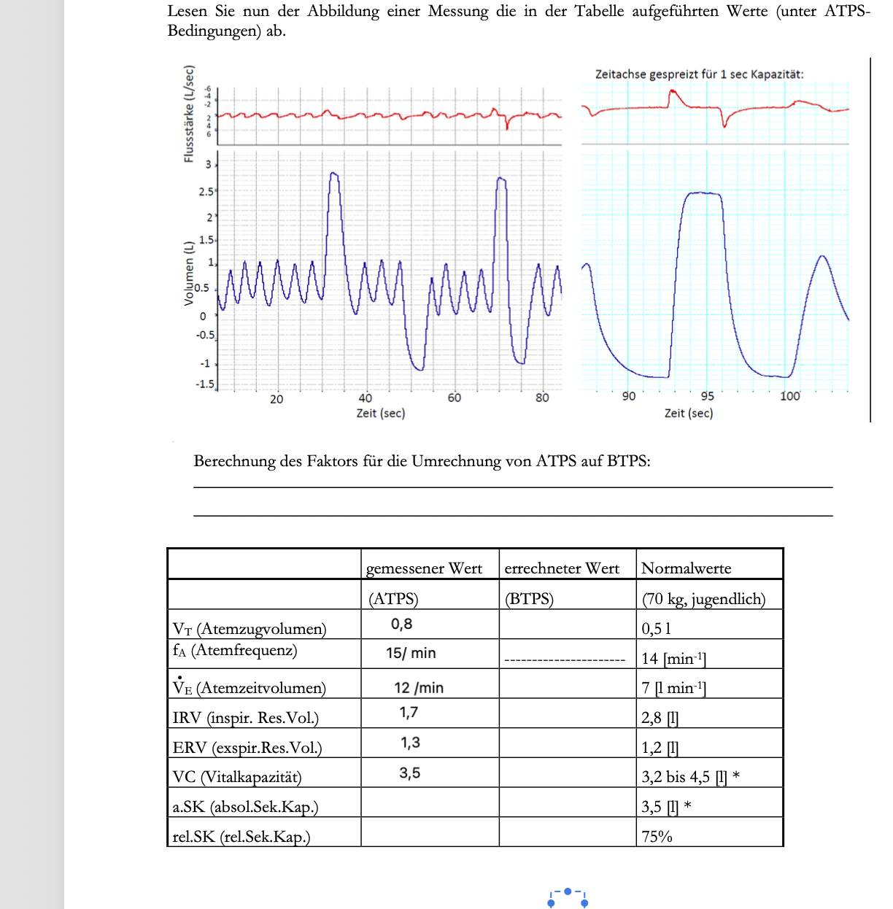

# OCT Labeling Tool

**English** | [Deutsch](#deutsch) | [한국어](#한국어)

---

## English

### Background

During a medical imaging lecture on early lung cancer detection, I learned that peripheral lung lesions found via low-dose CT screening are very difficult to biopsy using conventional bronchoscopy.

Optical biopsy based on OCT is emerging as a radiation-free future diagnostic approach. However, lung OCT images may still suffer from limited penetration depth, speckle noise, motion artifacts, and interpretation challenges. This project focuses on a first practical step toward AI-assisted analysis: building a structured annotation workflow for imperfect medical imaging data.

While general annotation tools like CVAT and Label Studio exist, I wanted to explore a lightweight desktop workflow specifically tailored to lung OCT lesion annotation.

I built this tool as an experimental MVP to explore an AI dataset annotation workflow for lung OCT images. It currently supports common image files, uncompressed grayscale DICOM preview loading, JSON export, YOLO-format export, COCO-format export, project save/load, coordinate validation, zoomable image review, brightness/contrast preview controls, image-level review tracking, and pre-export dataset validation. Future plans include mask annotation.

### What I Built

A lightweight desktop tool for annotating lung OCT images, designed to generate labeled datasets for future AI training.



### Features

- Load multiple images (jpg, jpeg, png, bmp, dcm, dicom, ima)
- Preview uncompressed 8-bit and 16-bit grayscale DICOM images
- Draw bounding boxes with mouse drag
- Move and resize existing bounding boxes
- Change labels on selected bounding boxes
- Zoom in/out with toolbar controls or Ctrl + mouse wheel
- Pan around zoomed images with scrollbars, trackpad scrolling, Alt + drag, or middle-button drag
- Preview brightness and contrast adjustments without modifying source images
- Label regions: Normal / Suspicious / Confirmed Cancer
- Keyboard shortcuts: ←/→ to navigate, 1/2/3 to select label
- Labels persist when switching between images
- Mark each image as reviewed and track overall dataset progress and label totals
- Review a validation report before export
- Right-click or two-finger tap to delete a box
- Multilingual UI: Korean / English / German
- Export to JSON with normalized coordinates
- Export to YOLO format for object detection training
- Export to COCO format for object detection datasets
- Save summary statistics to `summary.json`
- Save YOLO helper files: `classes.txt`, `data.yaml`, and an `images/` copy folder when source files are available
- Choose export folders for JSON, YOLO, and COCO outputs
- Project save/load using `project.json`, including reviewed image status
- Project files preserve image width and height even for reviewed images with no bounding boxes
- Coordinate clamping for safer dataset export
- Automatic discard of bounding boxes smaller than 5×5 pixels

### Tech Stack

- Java 21
- JavaFX 21
- Maven
- Gson
- dcm4che
- JUnit

### How to Run

#### Requirements

- Java 21
- JavaFX 21 SDK
- Maven

#### Run with Maven

```bash
mvn javafx:run
```

#### Build a runnable package

```bash
mvn package
java -jar target/oct-labeling-tool-1.0-SNAPSHOT.jar
```

The package step creates the app jar and copies runtime dependencies into `target/lib`.

#### Manual Compile

```bash
javac --module-path /path/to/javafx/lib --add-modules javafx.controls \
  -cp /path/to/gson.jar \
  src/main/java/com/peanutsmin/octlabeling/*.java
```

#### macOS Manual Example

```bash
javac --module-path ~/javafx-sdk/javafx-sdk-21.0.2/lib --add-modules javafx.controls \
  -cp $HOME/.m2/repository/com/google/code/gson/gson/2.10.1/gson-2.10.1.jar \
  src/main/java/com/peanutsmin/octlabeling/*.java
java --module-path ~/javafx-sdk/javafx-sdk-21.0.2/lib --add-modules javafx.controls \
  -cp src/main/java:$HOME/.m2/repository/com/google/code/gson/gson/2.10.1/gson-2.10.1.jar \
  com.peanutsmin.octlabeling.MainApp
```

### Workflow

1. Load OCT images
2. Draw bounding boxes with mouse drag
3. Assign labels: Normal / Suspicious / Confirmed Cancer
4. Mark reviewed images and monitor overall dataset progress
5. Save the project as `project.json` for future sessions
6. Reopen the project to continue or correct annotations
7. Review the validation report before export
8. Export annotations as JSON, YOLO, or COCO format for AI training

### Export Format Examples

#### JSON Export

```json
[
  {
    "file": "image.jpeg",
    "label": "suspicious",
    "x": 0.2425,
    "y": 0.1897,
    "w": 0.18,
    "h": 0.12,
    "x_pixel": 72,
    "y_pixel": 31,
    "image_width": 300,
    "image_height": 168
  }
]
```

#### YOLO Export

YOLO export writes a dataset-style folder with:

```txt
labels_yolo/
images/
classes.txt
data.yaml
```

```txt
1 0.332500 0.249700 0.180000 0.120000
```

YOLO format:

```txt
class_id x_center y_center width height
```

Class mapping:

```txt
0 = Normal
1 = Suspicious
2 = Confirmed Cancer
```

#### COCO Export

COCO export writes `coco_annotations.json` with `images`, `annotations`, and `categories` arrays:

```json
{
  "images": [
    { "id": 1, "file_name": "image.jpeg", "width": 300, "height": 168 }
  ],
  "annotations": [
    {
      "id": 1,
      "image_id": 1,
      "category_id": 1,
      "bbox": [72, 31, 54, 20],
      "area": 1080,
      "iscrowd": 0
    }
  ],
  "categories": [
    { "id": 0, "name": "normal", "supercategory": "lung_oct" },
    { "id": 1, "name": "suspicious", "supercategory": "lung_oct" },
    { "id": 2, "name": "confirmed_cancer", "supercategory": "lung_oct" }
  ]
}
```

#### Label Schema

Exported JSON uses stable machine-readable labels:

```txt
normal = Normal
suspicious = Suspicious
confirmed_cancer = Confirmed Cancer
```

These values are independent from the selected UI language.

### Limitations

- This tool is an experimental MVP and is not intended for clinical diagnosis.
- It currently supports bounding-box annotation only.
- DICOM support is limited to uncompressed single-channel grayscale images.
- Mask-based annotation is planned for a future version.
- Zoom changes only the display scale; exported coordinates remain normalized to the original image size and should still be validated before research use.
- Brightness and contrast controls are display-only previews; exported image files and annotation coordinates are not modified.

### Validation

- Project files are saved and loaded using Gson with user-visible success/failure alerts.
- DICOM loading is covered by a generated uncompressed grayscale DICOM fixture test.
- Reviewed image status is saved and restored with project files.
- Pre-export validation reports unreviewed images, empty images, invalid boxes, clipped boxes, tiny boxes, exportable label count, and skewed label distribution.
- YOLO export uses normalized center coordinates: `x_center`, `y_center`, `width`, `height`.
- COCO export uses pixel bounding boxes: `x`, `y`, `width`, `height`, and keeps image dimensions for reviewed empty images.
- JSON, YOLO, and COCO exports share the same coordinate clamping logic before writing files.
- Export behavior is covered by JUnit tests, including out-of-bounds box clipping, COCO output, empty-image metadata, and locale-safe YOLO decimals.
- Bounding boxes smaller than 5×5 pixels are automatically discarded.

---

## Deutsch

### Hintergrund

Während einer Vorlesung über Früherkennung von Lungenkrebs erfuhr ich, dass periphere Lungenläsionen, die im Low-dose-CT-Screening entdeckt werden, mit konventioneller Bronchoskopie sehr schwer zu biopsieren sind.

Optische Biopsie auf OCT-Basis gilt als strahlungsfreier diagnostischer Ansatz der Zukunft. Allerdings können Lungen-OCT-Bilder durch begrenzte Eindringtiefe, Speckle-Rauschen, Bewegungsartefakte und schwierige Interpretierbarkeit beeinträchtigt sein. Dieses Projekt konzentriert sich deshalb auf einen ersten praktischen Schritt in Richtung AI-gestützter Analyse: einen strukturierten Annotation-Workflow für unvollkommene medizinische Bilddaten. Obwohl allgemeine Annotationstools wie CVAT und Label Studio existieren, wollte ich einen leichtgewichtigen Desktop-Workflow speziell für die Annotation von Lungen-OCT-Läsionen experimentell umsetzen.

Dieses Tool wurde als experimentelles MVP entwickelt, um einen Workflow zur Erstellung von AI-Trainingsdatensätzen für Lungen-OCT-Bilder zu untersuchen. Es unterstützt aktuell gängige Bilddateien, Vorschau unkomprimierter Graustufen-DICOM-Dateien, JSON-Export, YOLO-Format-Export, COCO-Format-Export, Projekt-Speichern/Laden, Koordinatenvalidierung, zoombare Bildprüfung, Helligkeits- und Kontrastvorschau, Review-Tracking pro Bild sowie Datensatzvalidierung vor dem Export. Geplante Erweiterungen sind Mask-Annotation.

### Was ich gebaut habe

Ein leichtgewichtiges Desktop-Tool zur Annotation von Lungen-OCT-Bildern, entwickelt zur Erstellung gelabelter Datensätze für zukünftiges AI-Training.


### Funktionen

- Mehrere Bilder laden (jpg, jpeg, png, bmp, dcm, dicom, ima)
- Unkomprimierte 8-Bit- und 16-Bit-Graustufen-DICOM-Bilder als Vorschau laden
- Bounding Boxes per Maus-Drag zeichnen
- Vorhandene Bounding Boxes verschieben und skalieren
- Labels ausgewählter Bounding Boxes ändern
- Per Toolbar oder Ctrl + Mausrad hinein- und herauszoomen
- In gezoomten Bildern per Scrollbar, Trackpad, Alt + Drag oder mittlerer Maustaste navigieren
- Helligkeit und Kontrast als Vorschau anpassen, ohne Quelldateien zu verändern
- Regionen beschriften: Normal / Verdächtig / Bestätigter Krebs
- Tastaturkürzel: ←/→ navigieren, 1/2/3 Label wählen
- Labels bleiben beim Wechsel zwischen Bildern erhalten
- Bilder als geprüft markieren und Gesamtfortschritt sowie Label-Gesamtzahlen verfolgen
- Vor dem Export einen Validierungsbericht prüfen
- Rechtsklick oder Zwei-Finger-Tap zum Löschen einer Box
- Mehrsprachige Oberfläche: Koreanisch / Englisch / Deutsch
- JSON-Export mit normalisierten Koordinaten
- YOLO-Format-Export für Object-Detection-Training
- COCO-Format-Export für Object-Detection-Datensätze
- Summary-Statistiken werden in `summary.json` gespeichert
- YOLO-Hilfsdateien: `classes.txt`, `data.yaml` und ein `images/`-Kopierordner, wenn Quelldateien vorhanden sind
- Exportordner für JSON-, YOLO- und COCO-Ausgaben auswählbar
- Projekt speichern/laden mit `project.json`, inklusive geprüftem Bildstatus
- Projektdateien behalten Bildbreite und Bildhöhe auch für geprüfte Bilder ohne Bounding Boxes
- Koordinaten-Clamping für sicheren Datensatz-Export
- Automatisches Verwerfen von Bounding Boxes kleiner als 5×5 Pixel

### Technologie

- Java 21
- JavaFX 21
- Maven
- Gson
- dcm4che
- JUnit

### Ausführen

#### Voraussetzungen

- Java 21
- JavaFX 21 SDK
- Maven

#### Mit Maven ausführen

```bash
mvn javafx:run
```

#### Ausführbares Paket bauen

```bash
mvn package
java -jar target/oct-labeling-tool-1.0-SNAPSHOT.jar
```

Der Paket-Build erstellt das App-Jar und kopiert Runtime-Abhängigkeiten nach `target/lib`.

#### Manuell kompilieren

```bash
javac --module-path /path/to/javafx/lib --add-modules javafx.controls \
  -cp /path/to/gson.jar \
  src/main/java/com/peanutsmin/octlabeling/*.java
```

### Workflow

1. OCT-Bilder laden
2. Bounding Boxes per Maus-Drag zeichnen
3. Label zuweisen: Normal / Verdächtig / Bestätigter Krebs
4. Geprüfte Bilder markieren und Gesamtfortschritt kontrollieren
5. Projekt als `project.json` speichern
6. Projekt erneut öffnen und Annotationen fortsetzen oder korrigieren
7. Validierungsbericht vor dem Export prüfen
8. Annotationen als JSON, YOLO- oder COCO-Format für AI-Training exportieren

### Export-Beispiele

#### JSON-Export

```json
[
  {
    "file": "image.jpeg",
    "label": "suspicious",
    "x": 0.2425,
    "y": 0.1897,
    "w": 0.18,
    "h": 0.12,
    "x_pixel": 72,
    "y_pixel": 31,
    "image_width": 300,
    "image_height": 168
  }
]
```

#### YOLO-Export

YOLO-Export schreibt einen dataset-artigen Ordner:

```txt
labels_yolo/
images/
classes.txt
data.yaml
```

```txt
1 0.332500 0.249700 0.180000 0.120000
```

YOLO-Format:

```txt
class_id x_center y_center width height
```

Klassen-Zuordnung:

```txt
0 = Normal
1 = Verdächtig
2 = Bestätigter Krebs
```

#### COCO-Export

Der COCO-Export schreibt `coco_annotations.json` mit `images`, `annotations` und `categories`:

```json
{
  "images": [
    { "id": 1, "file_name": "image.jpeg", "width": 300, "height": 168 }
  ],
  "annotations": [
    {
      "id": 1,
      "image_id": 1,
      "category_id": 1,
      "bbox": [72, 31, 54, 20],
      "area": 1080,
      "iscrowd": 0
    }
  ],
  "categories": [
    { "id": 0, "name": "normal", "supercategory": "lung_oct" },
    { "id": 1, "name": "suspicious", "supercategory": "lung_oct" },
    { "id": 2, "name": "confirmed_cancer", "supercategory": "lung_oct" }
  ]
}
```

#### Label-Schema

Der JSON-Export verwendet stabile maschinenlesbare Labels:

```txt
normal = Normal
suspicious = Verdächtig
confirmed_cancer = Bestätigter Krebs
```

Diese Werte sind unabhängig von der gewählten UI-Sprache.

### Einschränkungen

- Dieses Tool ist ein experimentelles MVP und nicht für klinische Diagnosen geeignet.
- Aktuell wird nur Bounding-Box-Annotation unterstützt.
- DICOM-Unterstützung ist auf unkomprimierte einkanalige Graustufenbilder beschränkt.
- Maskenbasierte Annotation ist für eine zukünftige Version geplant.
- Zoom ändert nur die Anzeigegröße; exportierte Koordinaten bleiben auf die Originalbildgröße normalisiert und sollten vor Forschungseinsatz weiterhin validiert werden.
- Helligkeits- und Kontraststeuerung sind reine Anzeigevorschauen; exportierte Bilddateien und Annotation-Koordinaten werden nicht verändert.

### Validierung

- Projektdateien werden mit Gson gespeichert und geladen, mit sichtbaren Erfolgs- und Fehlermeldungen.
- DICOM-Laden wird durch einen generierten unkomprimierten Graustufen-DICOM-Test abgedeckt.
- Der geprüfte Bildstatus wird mit Projektdateien gespeichert und wiederhergestellt.
- Die Validierung vor dem Export meldet ungeprüfte Bilder, Bilder ohne Annotationen, ungültige Boxen, zugeschnittene Boxen, sehr kleine Boxen, exportierbare Label-Anzahl und unausgewogene Label-Verteilung.
- YOLO-Export verwendet normalisierte Mittelpunkt-Koordinaten: `x_center`, `y_center`, `width`, `height`.
- COCO-Export verwendet Pixel-Bounding-Boxes und behält Bilddimensionen für geprüfte leere Bilder: `x`, `y`, `width`, `height`.
- JSON-, YOLO- und COCO-Export verwenden dieselbe Koordinatenbegrenzung vor dem Schreiben.
- Das Exportverhalten wird durch JUnit-Tests geprüft, inklusive Clipping außerhalb des Bildbereichs, COCO-Ausgabe, Metadaten für leere Bilder und locale-sicherer YOLO-Dezimalzahlen.
- Bounding Boxes kleiner als 5×5 Pixel werden automatisch verworfen.

---

## 한국어

### 배경

폐암 조기 진단 강의에서 저선량 CT 스크리닝으로 발견된 말초 폐 병변은 기존 기관지내시경으로 생검하기 매우 어렵다는 것을 배웠습니다.

OCT 기반 광학 생검은 방사선 부담이 없는 미래 진단 접근법으로 주목받고 있습니다. CVAT, Label Studio 같은 범용 라벨링 툴은 존재하지만, 폐 OCT 병변 라벨링에 맞춘 가벼운 데스크톱 워크플로우를 실험적으로 구현해보고 싶었습니다. 다만 폐 OCT 영상은 침투 깊이 제한, speckle noise, motion artifact, 해석 기준의 어려움 같은 문제가 있어 항상 선명하고 일관된 데이터로 얻어지지는 않습니다. 이 프로젝트는 이러한 한계 속에서 AI 보조 분석을 위한 첫 단계인 구조화된 annotation workflow를 실험하는 데 초점을 두었습니다.

AI 학습용 데이터셋 구축 과정을 직접 실험해보기 위해 이 툴을 제작했습니다. 현재 일반 이미지 파일, 비압축 grayscale DICOM 미리보기, JSON export, YOLO format export, COCO format export, 프로젝트 저장/불러오기, 좌표 검증, 확대 가능한 이미지 검토, 밝기/대비 미리보기, 이미지별 검수 상태 추적, 전체 라벨 통계 확인, export 전 데이터셋 검증 기능을 지원합니다. 향후 mask annotation을 추가할 예정입니다.

### 제작한 것

폐 OCT 이미지를 라벨링하고, 향후 AI 학습용 데이터셋을 만들기 위한 가벼운 데스크톱 annotation tool입니다.


### 기능

- 여러 장 이미지 선택 (jpg, jpeg, png, bmp, dcm, dicom, ima)
- 비압축 8-bit/16-bit grayscale DICOM 이미지 미리보기
- 마우스 드래그로 bounding box 그리기
- 기존 bounding box 이동 및 리사이즈
- 선택한 bounding box 라벨 변경
- 툴바 버튼 또는 Ctrl + 마우스 휠로 확대/축소
- 확대된 이미지는 스크롤바, 트랙패드 스크롤, Alt + 드래그, 중간 버튼 드래그로 이동
- 원본 이미지를 수정하지 않는 밝기/대비 미리보기 조절
- 정상 / 의심 / 확실히 암 라벨 선택
- 단축키: ←/→ 이미지 이동, 1/2/3 라벨 선택
- 이미지 전환 시 라벨 유지
- 이미지별 검수 완료 표시 및 전체 데이터셋 진행률/라벨 통계 확인
- export 전 validation report 확인
- 우클릭 또는 두 손가락 탭으로 박스 삭제
- 한국어 / English / Deutsch UI 전환
- 정규화된 좌표로 JSON export
- AI 객체탐지 학습용 YOLO format export
- 객체탐지 데이터셋용 COCO format export
- `summary.json`에 통계 저장
- YOLO 보조 파일 저장: `classes.txt`, `data.yaml`, 원본 이미지가 존재할 경우 `images/` 복사 폴더
- JSON/YOLO/COCO export 폴더 선택
- 검수 완료 상태를 포함한 `project.json` 기반 프로젝트 저장/불러오기
- bounding box가 없는 검수 완료 이미지도 프로젝트와 COCO export에서 이미지 너비/높이 유지
- 안전한 데이터셋 export를 위한 좌표 clamp
- 5×5 픽셀보다 작은 bounding box 자동 제외

### 기술 스택

- Java 21
- JavaFX 21
- Maven
- Gson
- dcm4che
- JUnit

### 실행 방법

#### 요구사항

- Java 21
- JavaFX 21 SDK
- Maven

#### Maven으로 실행

```bash
mvn javafx:run
```

#### 실행 가능한 패키지 빌드

```bash
mvn package
java -jar target/oct-labeling-tool-1.0-SNAPSHOT.jar
```

`mvn package`는 앱 jar와 실행에 필요한 runtime dependency를 `target/lib`에 함께 복사합니다.

#### 수동 컴파일

```bash
javac --module-path /path/to/javafx/lib --add-modules javafx.controls \
  -cp /path/to/gson.jar \
  src/main/java/com/peanutsmin/octlabeling/*.java
```

#### macOS 수동 실행 예시

```bash
javac --module-path ~/javafx-sdk/javafx-sdk-21.0.2/lib --add-modules javafx.controls \
  -cp $HOME/.m2/repository/com/google/code/gson/gson/2.10.1/gson-2.10.1.jar \
  src/main/java/com/peanutsmin/octlabeling/*.java
java --module-path ~/javafx-sdk/javafx-sdk-21.0.2/lib --add-modules javafx.controls \
  -cp src/main/java:$HOME/.m2/repository/com/google/code/gson/gson/2.10.1/gson-2.10.1.jar \
  com.peanutsmin.octlabeling.MainApp
```

### 사용 흐름

1. OCT 이미지 불러오기
2. 마우스 드래그로 bounding box 그리기
3. 정상 / 의심 / 확실히 암 라벨 선택
4. 검수 완료 이미지를 표시하고 전체 데이터셋 진행률 확인
5. 나중에 이어서 작업할 수 있도록 `project.json`으로 프로젝트 저장
6. 프로젝트를 다시 열어 annotation을 이어서 수정
7. export 전 validation report 확인
8. AI 학습용으로 JSON, YOLO 또는 COCO 형식 export

### Export 예시

#### JSON Export

```json
[
  {
    "file": "image.jpeg",
    "label": "suspicious",
    "x": 0.2425,
    "y": 0.1897,
    "w": 0.18,
    "h": 0.12,
    "x_pixel": 72,
    "y_pixel": 31,
    "image_width": 300,
    "image_height": 168
  }
]
```

#### YOLO Export

YOLO export는 다음과 같은 dataset-style 폴더를 생성합니다:

```txt
labels_yolo/
images/
classes.txt
data.yaml
```

```txt
1 0.332500 0.249700 0.180000 0.120000
```

YOLO 형식:

```txt
class_id x_center y_center width height
```

클래스 매핑:

```txt
0 = 정상
1 = 의심
2 = 확실히 암
```

#### COCO Export

COCO export는 `images`, `annotations`, `categories` 배열을 포함한 `coco_annotations.json`을 생성합니다:

```json
{
  "images": [
    { "id": 1, "file_name": "image.jpeg", "width": 300, "height": 168 }
  ],
  "annotations": [
    {
      "id": 1,
      "image_id": 1,
      "category_id": 1,
      "bbox": [72, 31, 54, 20],
      "area": 1080,
      "iscrowd": 0
    }
  ],
  "categories": [
    { "id": 0, "name": "normal", "supercategory": "lung_oct" },
    { "id": 1, "name": "suspicious", "supercategory": "lung_oct" },
    { "id": 2, "name": "confirmed_cancer", "supercategory": "lung_oct" }
  ]
}
```

#### 라벨 스키마

JSON export는 UI 언어와 무관한 고정 라벨 값을 사용합니다:

```txt
normal = 정상
suspicious = 의심
confirmed_cancer = 확실히 암
```

### 한계 및 주의사항

- 이 툴은 실험적 MVP이며 임상 진단 목적으로 사용할 수 없습니다.
- 현재 bounding-box 방식의 annotation만 지원합니다.
- DICOM 지원은 비압축 single-channel grayscale 이미지로 제한됩니다.
- mask 기반 annotation은 향후 추가 예정입니다.
- Zoom은 화면 표시 배율만 바꾸며, export 좌표는 원본 이미지 크기 기준으로 정규화됩니다. 연구용으로 사용하기 전에는 여전히 검증이 필요합니다.
- 밝기/대비 조절은 화면 표시용 미리보기이며, export 이미지 파일과 annotation 좌표는 변경하지 않습니다.

### 검증

- 프로젝트 파일은 Gson으로 저장하고 불러오며, 성공/실패를 UI Alert로 표시합니다.
- DICOM 로딩은 테스트에서 생성한 비압축 grayscale DICOM fixture로 검증합니다.
- 이미지별 검수 완료 상태는 project 파일에 저장되고 다시 불러올 수 있습니다.
- 상태바에서 전체 이미지 수, 검수 완료 이미지 수, 라벨별 전체 개수를 확인할 수 있습니다.
- export 전 검증은 미검수 이미지, annotation 없는 이미지, 유효하지 않은 박스, 이미지 경계에서 잘리는 박스, 5x5 픽셀보다 작은 박스, export 가능한 라벨 수, 한쪽으로 치우친 라벨 분포를 알려줍니다.
- YOLO export는 정규화된 중심 좌표를 사용합니다: `x_center`, `y_center`, `width`, `height`.
- COCO export는 픽셀 bounding box를 사용하며, bounding box가 없는 검수 이미지의 이미지 크기도 유지합니다: `x`, `y`, `width`, `height`.
- JSON, YOLO, COCO export는 같은 좌표 clamp 로직을 공유합니다.
- out-of-bounds box clipping, COCO 출력, 빈 이미지 메타데이터, locale-safe YOLO 소수점 출력은 JUnit 테스트로 검증합니다.
- 5×5 픽셀보다 작은 bounding box는 자동으로 제외됩니다.
